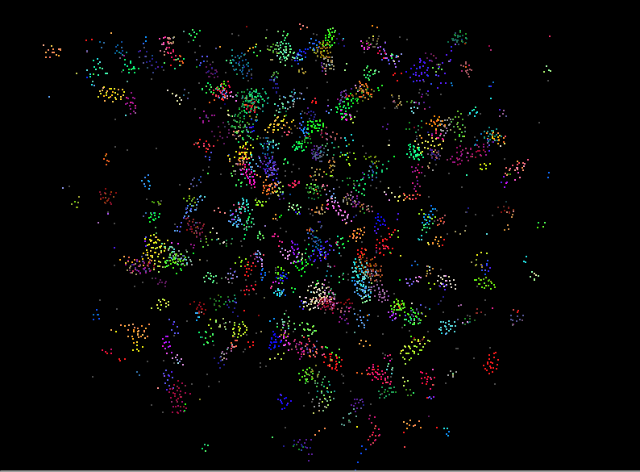

**University of Pennsylvania, CIS 5650: GPU Programming and Architecture,
Project 1 - Flocking**

* Aaron Jiang
  * [LinkedIn](https://www.linkedin.com/in/aaronpjiang/), [personal website](https://aaron-jiang.com/)
* Tested on: Windows 11, i5-13420H @ 1.99GHz 15.6GB, GTX 4050 13.8MB (Personal Computer)
### Boids Simulator

This repository contains a boids simulator created for CIS 5650 using CUDA on the GPU. It contains three simulation steppers, a naive approach iterating against all boids in the scene as potential neighbors, a scattered grid-based approach that only checks boids spatially close to the target boid, and a coherent grid-based approach that improves the previous by ensuring data gathered from the pos and vel vectors are coherent spatially.  

Coherent approach at 5,000 boids  
  

Coherent approach at 50,000 boids
  

Coherent approach at 100,000 boids  

### Results and Analysis

The above graph shows the runtime in ms of the simulation step function captured using GPU events. A higher time here means a lower fps. To put the fps for the graph in perspective, a 0.1 ms simulation step exectution would translate to 10,000 fps, while a 100 ms simulation step would translate to 10 fps. This graph was plotted on a log-log scale to make the differences between the approaches more apparant. It features the execution time on the y-axis and the number of boids on the x-axis.  

The Naive approach was slower than the two other strategies for all simulations where the boid count was greater than around 1,000. This is expected because for each thread calculating the new velocity of a boid, it would need to check with every other boid in the simulation.  

The Scattered and Coherent approaches were notably faster than the Naive strategy as the number of boids used was considerably less as boids would only have to check boids residing in the grid cells from the spatial grid data structure that were nearby to its grid cell. 

The Coherent approach was indeed faster than the scattered approach especially for larger amounts of boids simulated. This is likely because coherent access of the pos and vel buffers allows for less cache misses due to spatially similar data also being retrived with each fetch. 

The reasoning for the Naive approach beating the two other approaches during simulations of under 1,000 boids is likely because of the overhead needed by the grid cell data structure, which with the default divisions, are tens of thousands of cells. The operations regarding grid cells in the Scattered and Coherent approaches then overshadow the contributions made by the actual particles, causing both of them to flatline in runtime when less than 1,000 boids.

Note that the overall shape of each of the lines is still the same. That is because all algorithms are still linear with respect to the boid count. That is, O(n). This is because, even when only looking at a constant grid cell around the particle, the amount of particles within the nearby grid cells will also grow as more and more particles are added. The slope is much lower for the Scattered and Coherent approaches but they are still in linear time.

Since I measured the ms that it took each respective simulation step function to occur, my timings did not including the cost incurred by the visualization of the boids onto the display, and so there was practically no difference between the Coherent approach with visualization on, and with visualization off. I anticipate this effect is the same for the other two methods as well.

Here is a graph measuring how a change in block size affects the execution time of the approaches. For simplicity, the Coherent approach was used for all tests. The general trend is, that more threads per block offers a slightly discounted execution time. This is likely because, as the block size gets smaller, each block has less warps, which perhaps makes the scheduler work harder to cover any latency during processor stalls. When the block size is high, the scheduler is very comfortable scheduling work to cover up all latencies during stalls.  

### Extra Credit
For extra credit, I implemented the grid-looping optimization so that any grid points within a bounding box formed by the maximum radius of interest would be automatically checked. This means my program can handle the surrounding 8 or 27 cells based on desired distance.